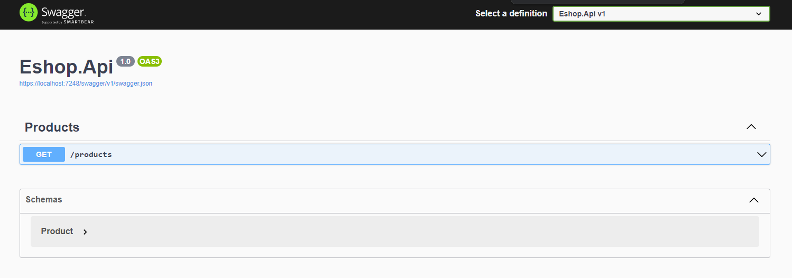

# Eshop

## Introduction
This repository addresses a cloud native aspnet core web api.

## Documentation
Find out api endpoints and make requests in ease per each available version with <b>Swagger UI</b>.

## Containerization
The service can get executed in any hosted OS because of <b>docker</b> support.

## Observability
The api supports <b>Prometheus</b>.

Access occurs in /metrics.
