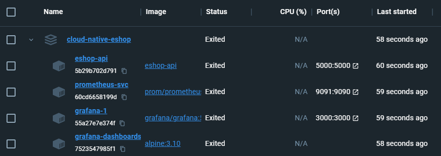
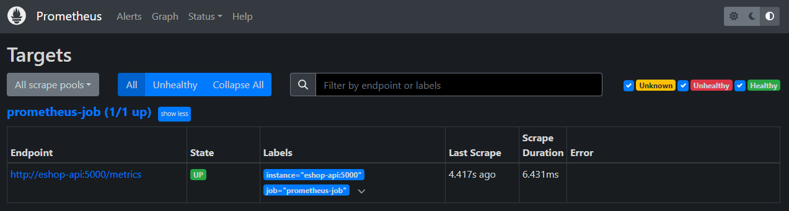

# Eshop

## Description
This repository addresses a cloud native aspnet core web api.

## Tech Stack
- .NET;
- Prometheus;
- Grafana;
- Docker.

## How to run
Execute the command:
```
docker-compose up
```

Need to install docker? Click [here](https://docs.docker.com/engine/install/).

# Results



